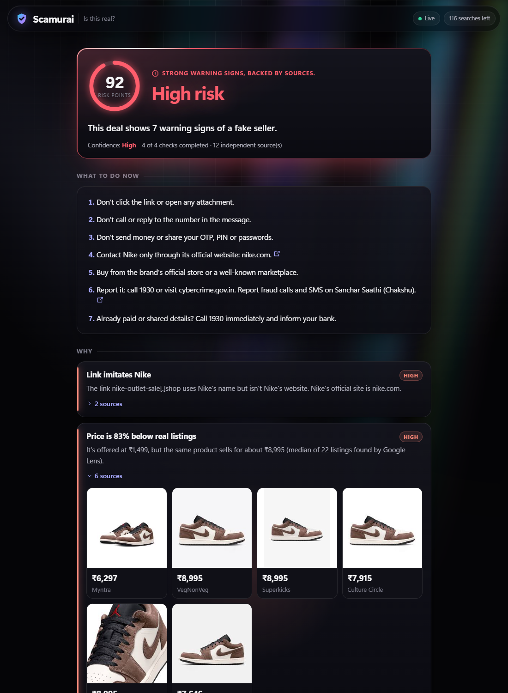
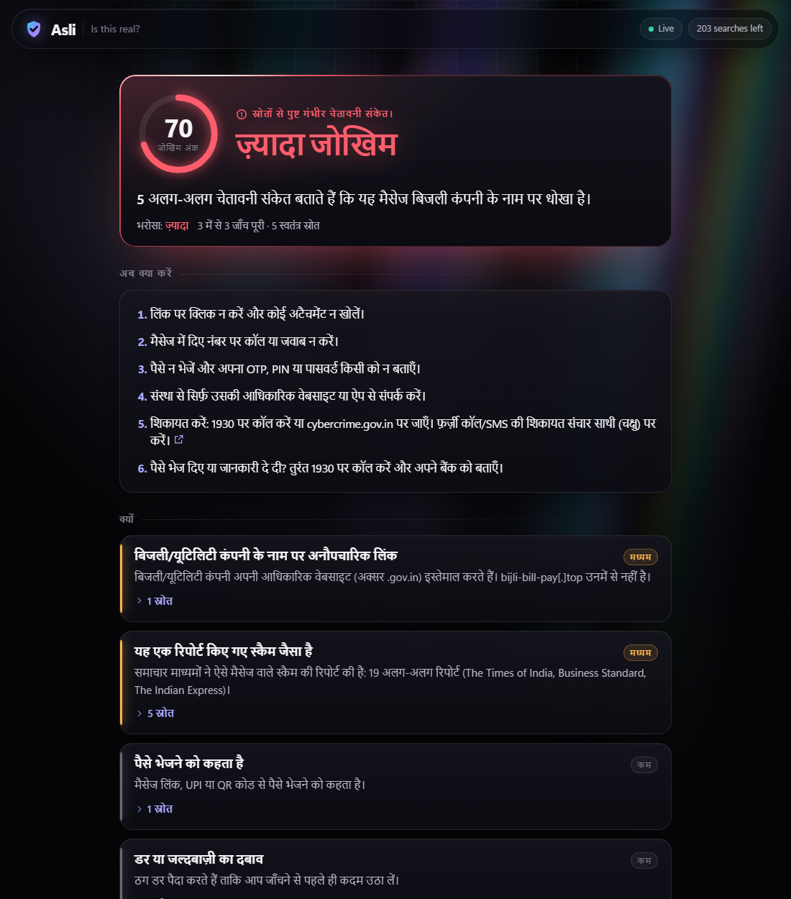
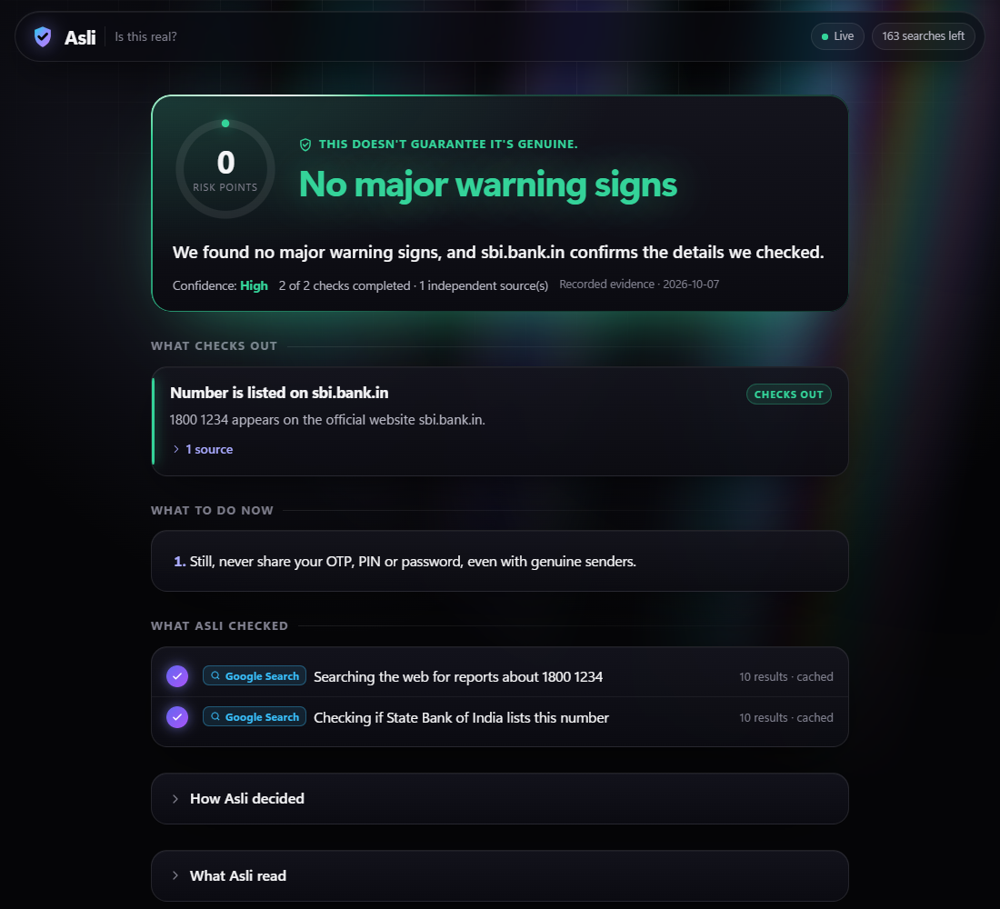
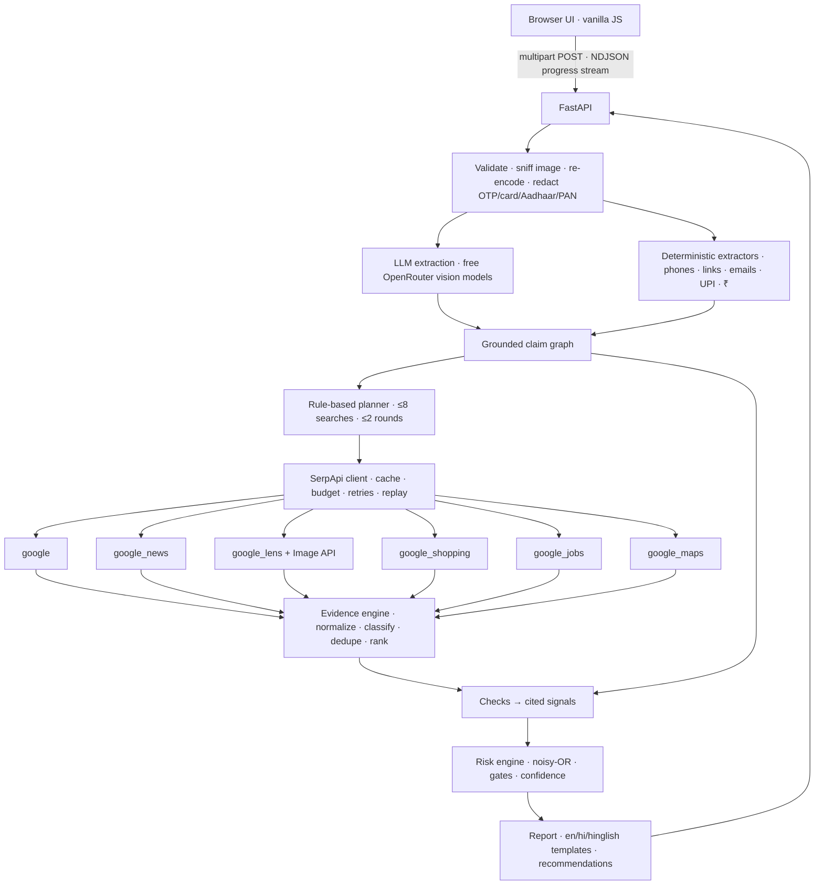

# Asli: is this real?

[](https://github.com/gautamhardik/asli/actions/workflows/ci.yml)


**Asli** (असली, "real") checks suspicious messages, screenshots, links and phone numbers. You paste or upload the message. Asli pulls out the claims it makes and **checks each claim against live web evidence through SerpApi**. It then returns a calm, source-cited risk report in English, Hindi or Hinglish.

> Asli doesn't classify a message from its wording. It checks the message's claims against the live web, and every warning links to its source.



**Demo video:** _link added at submission_ · **Track:** Knowledge & Public Interest · **Built for:** SerpApi India Hackathon 2026

---

## The problem

Almost every phone in India receives messages like these:

- "Your electricity will be cut tonight, pay ₹13 here"
- "Your KYC is pending"
- "Your parcel is held at customs"
- "You're selected, pay a refundable registration fee"
- Deals at 90% off
- "Customer-care" numbers found through search

Checking even one of them properly takes about 15 minutes. You'd have to find the real company's website, look up the number, search for complaints and compare prices. Most people don't, and the result is a constant stream of losses to cyber fraud.

## The insight

**Scammers reuse their scripts, phone numbers, product photos, domains and addresses, and each reuse leaves a trace on the web.**

- A fake electricity SMS matches news reports about that exact script.
- A "₹1,499 Nike" deal uses a photo that Google Lens finds on Nike India and Myntra at ₹6,300–₹9,000.
- A fake HR email comes from Gmail, while the company's official domain is infosys.com.
- The "office" address resolves on Google Maps to apartment buildings.

A language model reading the message alone can only guess. Live search finds the evidence.

## What Asli does

1. **Reads the claims.** It extracts who the message claims to be, plus every phone number, link, email, UPI ID, amount, product, price, job, address and app it mentions. Screenshots in Hindi work too. Every value must appear in the text you gave, or in the model's transcription of your screenshot (it is *grounded*), so a number the model invents can't be searched.
2. **Plans the checks.** A rules-based planner chooses only the searches that matter for this kind of message. It plans at most 8 searches in 2 rounds.
3. **Searches the live web through SerpApi.** It uses Google Search, News, Lens (with the Image API), Shopping, Jobs and Maps.
4. **Weighs the evidence.** A transparent formula turns evidence into a risk level. The AI never sets the score.
5. **Explains.** The report gives a verdict, a confidence level, flags with sources, and what to do next (1930, cybercrime.gov.in, Chakshu).

| | |
|---|---|
|  |  |
| A Hindi screenshot gets a Hindi report, citing Times of India, Business Standard and Indian Express coverage of this scam. | A genuine SBI alert: the helpline is confirmed on SBI's own contact page, and the report says so with a link. |

---

## How Asli uses SerpApi

SerpApi supplies all of Asli's evidence. Without it, Asli could only look for wording patterns. Each engine answers one specific question:

| Engine | Question it answers | How Asli queries it | What it can prove |
|---|---|---|---|
| **Google Search** (`google`) | What is the claimed organisation's official website and contact? | `"{org}" official website` (knowledge graph + top result) | The link or email domain isn't the organisation's (**I2**); all links are official (**T2**) |
| **Google Search** | Has this exact number, UPI ID or domain been reported? | `"7000012345" OR "70000 12345" OR "+91 70000 12345"` / `"{upi}"` / `"{domain}"` | Reported in scam posts on independent sites (**W1/W12/W2**); no result mentions the domain (**W4**, cites the search so you can re-run it) |
| **Google Search** (round 2) | Does the official site list this number? | `site:{official} ("…")` | Listed on an official contact page (**T1**), or not listed (**W3**) |
| **Google News** (`google_news`) | Has this kind of message been reported as a scam? | Curated per-scheme query (e.g. `electricity bill disconnection SMS scam`) | Independent news reports of this kind of scam (**W6**); the brand is often impersonated (**W7**). Context only: they count only when the message itself shows a scam's mechanics |
| **Image API + Google Lens** (`google_lens`) | Where else does this product photo appear, and at what price? | Upload the screenshot (≤480 KB, 0 credits) → `image_id` | The photo (or a near-identical one) is on real listings (**W9**); real ₹ prices for the same product |
| **Google Shopping** (`google_shopping`) | What does this product really cost? | `{brand} {product}`; only if Lens finds fewer than 3 prices | Price far below the median real price (**W8**), or plausible (**T5**) |
| **Google Jobs** (`google_jobs`) | Is this company actually hiring for this role? | `{role} {company} {city}` | No matching listing (**W10**) or a match (**T3**) |
| **Google Maps** (`google_maps`) | Is the company really at this address? | The address from the message | The address resolves to homes or hotels (**W11**), or matches the company (**T4**) |

**Using credits carefully** (the free plan allows 250 searches a month):
- Every response is cached in SQLite, keyed by engine plus normalized parameters (never the API key). Lens results are keyed by the image's hash, because upload IDs expire.
- Identical searches within one investigation share a single request.
- Each investigation is limited to 8 searches and 2 rounds, with a daily cap and a credit reserve read from SerpApi's free account endpoint.
- Once SerpApi reports the quota is used up, queued searches are skipped instead of retried.
- The 10 demo scenarios replay from recorded real responses at zero credits.

---

## The risk engine

The LLM only reads the message. The score comes from fixed, documented rules:

```
risk   = 1 − Π (1 − wᵢ · cᵢ)      over risk signals   (independent warning signs add up)
trust  = 1 − Π (1 − vⱼ · cⱼ)      over trust signals  (official confirmation)
points = round(100 · risk · (1 − 0.75 · trust))     → risk points, not a probability
```

Each signal has a fixed weight **w** and a confidence **c**. The confidence comes from its evidence, for example 0.60 / 0.80 / 0.95 for 1 / 2 / 3+ independent sites. There are 33 signals in four groups:

- **Identity:** lookalike domain, official-domain mismatch, free-mail sender, punycode, helpline that is a personal mobile number, an authority collecting money to a personal UPI ID.
- **Web evidence:** reported number, UPI ID or domain, reported scam pattern, price anomaly, reused photo, missing job listing, address mismatch, and others.
- **Message patterns:** OTP or remote-access requests, upfront fees, money demanded under threat of arrest ("digital arrest"), paid "tasks", threats, payment requests, hidden instructions aimed at AI tools, risky TLDs, and others.
- **Trust:** number on an official site, links to the official domain, matching job listing, Maps match, plausible price.

**Gates that keep weak evidence from producing strong verdicts:**

- **G1:** *High risk* requires either one strong identity or web signal (c ≥ 0.6 and w·c ≥ 0.25) or a critical request (OTP or PIN, an upfront fee, or money demanded under threat of arrest). The absence of results alone can never make something high risk.
- **G2:** If only message patterns fired, the score is capped at 55.
- **G3:** If an official source confirms an entity that also has risk evidence (scammers spoof real helplines), the verdict is *Be careful – mixed evidence*.
- **G4:** *No major warning signs* needs positive confirmation: an official page listing the number, a link on the official domain, or a real job listing (a trust signal with w·c ≥ 0.3). Searches that merely returned something prove nothing.
- **Coverage:** If too few checks finished, or nothing could be checked, the verdict is *Couldn't verify* rather than "safe".

| Level | When |
|---|---|
| **High risk** | 65+ points and G1 satisfied |
| **Be careful** | 35–64 points, or a high score demoted by G1 or G3 |
| **No major warning signs** | Under 35 points, checks completed and positive confirmation (G4). The report adds "doesn't guarantee it's genuine". |
| **Couldn't verify** | Under 35 points without confirmation, or too little evidence either way |

**Citation rule.** Every flag cites evidence. Web and trust flags must cite a search result or an official reference, and a flag that can't is dropped. Message-pattern flags quote the exact sentence. Click **How Asli decided** in any report to see each signal's w, c and contribution.

**Safeguards against false positives:**
- A scam word must appear *in the same result* as the number or domain, and for numbers and UPI IDs it must be scam-specific ("scam", "fake", "cheated", "ठगी"): words like "complaint" or "fraud" also appear on helpline directories and on banks' own fraud warnings.
- **A website can't vouch for itself.** A domain the message supplies is never accepted as the claimed organisation's official site, even when it ranks first for a made-up company name.
- A number counts as official only on an official **contact or help page**, never on a product, seller or forum page, where scammers plant fake helplines.
- News about a kind of scam counts only when the message itself shows that scam's mechanics, so a genuine SBI alert doesn't inherit every "SBI scam" headline.
- A merchant UPI ID in a transaction notice ("debited … to VPA swiggy@icici") isn't treated as a request to pay.
- Several results from the same site count as one source.
- Official helplines quoted in fraud warnings need 3 or more independent reports before they're flagged.
- Big platforms are never treated as suspicious domains.
- Lens prices are filtered to the same product, so "Jordan 1 Low" is never compared with "Jordan 1 High".
- Sender IDs and generic roles ("Electricity Officer") are not treated as organisations.

---

## Supported scams

| Type | Example | Main checks |
|---|---|---|
| Fake authority or company message | Electricity cut-off, KYC, bank block, courier, "digital arrest" | Link vs official domain, news reports of the pattern, number reputation |
| Fake customer-care number | "Amazon customer care 98765…" | Official contact pages, helpline is a mobile number, complaint reports |
| Too-good-to-be-true deal | "Nike ₹1,499, 90% off" | Google Lens photo matches and prices, Shopping prices, lookalike shop domain |
| Fake job offer | "Selected! Pay a ₹2,500 registration fee" | Free-mail sender, Google Jobs, Google Maps address, fee request |
| Task scam | "Like videos and earn ₹3,000/day" | Paid-task hook, news reports of the pattern |
| "Digital arrest" / extortion | "CBI officer: stay on video call, send a deposit" | Threat + payment, personal UPI ID for an authority, UPI reputation, news reports |
| Anything else | Vague openers, unknown links | Returns *Couldn't verify* rather than guessing |

## Measured results

A 30-message evaluation set ([`eval/messages.json`](eval/messages.json)) in English, Hindi and Hinglish:
- **10 genuine messages** in the style of real senders: SBI, IRCTC, UIDAI, Amazon, Swiggy, Flipkart, EPFO, Tata Power, the Income Tax Department, and a friend.
- **10 scams.**
- **10 ambiguous messages** with too little to decide either way.

Run it with `uv run python scripts/evaluate.py` (rules only, free) or add `--live`.

| | Live (AI reader + SerpApi) | Rules only (no AI, no search) |
|---|---|---|
| Scams flagged (*High risk* or *Be careful*) | **10/10** (4 high risk, 6 be careful) | 5/10 |
| Genuine messages wrongly flagged | **0/10** | 0/10 |
| Genuine messages positively confirmed (official page or domain) | 6/10 (the other 4: *Couldn't verify*) | 3/10 |
| Ambiguous messages kept at *Couldn't verify* | 10/10 | 10/10 |
| SerpApi credits for all 30 | 21 (first run; re-runs hit the cache) | 0 |

**Read these numbers with care.** The set is small and hand-written by the developer, and it was used while fixing bugs, so it is not a held-out test. Its main job is catching false alarms: the live run found one (a genuine SBI debit alert scored *High risk*), and [docs/AUDIT.md](docs/AUDIT.md) explains the fix.

---

## Quick start

You need [uv](https://docs.astral.sh/uv/). It installs Python 3.12 automatically.

```bash
git clone https://github.com/gautamhardik/asli && cd asli
uv sync
uv run asli demo          # replay mode: recorded real evidence, no keys or network → http://127.0.0.1:8000
```

**Live mode** needs a free [SerpApi key](https://serpapi.com/users/sign_up) and a free [OpenRouter key](https://openrouter.ai/keys):

```bash
cp .env.example .env      # add SERPAPI_API_KEY and OPENROUTER_API_KEY
uv run asli serve         # http://127.0.0.1:8000
```

Without uv: `pip install -e . && python -m asli serve`.

### Command line

```bash
uv run asli check "Your SBI account will be blocked today. Update KYC at sbi-kyc-update.in"
uv run asli check --image screenshot.jpg
uv run asli check --scenario nike_deal --replay     # any demo scenario, offline
uv run asli record --all                            # re-record demo scenarios from live searches
uv run asli doctor                                  # keys, SerpApi credits, model availability
```

### Environment variables

| Variable | Default | Purpose |
|---|---|---|
| `SERPAPI_API_KEY` | — | Live searches |
| `OPENROUTER_API_KEY` | — | Reading messages and screenshots. Without it, Asli falls back to rules-only extraction. |
| `ASLI_MODE` | `live` | `replay` serves recorded evidence |
| `ASLI_MAX_SEARCHES` | `8` | Searches per investigation |
| `ASLI_DAILY_SEARCH_CAP` | `80` | Live searches per day |
| `ASLI_MIN_CREDITS_RESERVE` | `10` | Stop live searching below this many SerpApi credits |
| `ASLI_STORE_REPORTS` | `true` | Keep reports locally for 7 days (`/#r=<id>`) |
| `ASLI_LLM_REASONING` | `off` | Model "thinking" for claim extraction (`off`, `low`, `medium`, `high`). Off is about 8× faster with the same extraction in our comparison. |
| `ASLI_ALLOWED_HOSTS` | — | Extra host names to serve besides 127.0.0.1/localhost (when deployed) |
| `ASLI_ACCESS_TOKEN` | — | Require a token for the API (open `/?token=…` once to set the cookie) |

---

## Architecture



Everything runs in one process with one SQLite file and no build step. The LLM sees only the user's message, never web content, and its output is closed-vocabulary JSON that is checked against the input.

```
src/asli/
  cli.py                  serve · demo · check · record · cache · doctor
  config.py  store.py  logs.py  errors.py  models.py  i18n.py
  ingest/                 validation, image safety, redaction, regex extractors
  llm/                    OpenRouter client (cache, fallback models), grounded extraction
  knowledge/              official domains, source classes, scam lexicon (EN/HI), scheme patterns
  serp/                   SerpApi client + per-engine normalizers
  investigate/            planner, evidence engine, checks, orchestrator
  risk/                   signal registry, engine, report builder
  web/                    FastAPI app + static UI
  demo/                   scenarios + recorded real SerpApi responses
tests/                    unit · integration · e2e (256 tests, run offline)
eval/                     30 labelled messages + results (scripts/evaluate.py)
```

## Security and privacy

- **No SSRF by design.** Asli never fetches a link you give it. Links are parsed and searched. The server only talks to `serpapi.com` and `openrouter.ai`.
- **Prompt injection.**
  - Message and screenshot text is passed as delimited, untrusted data.
  - The model returns only closed-vocabulary JSON.
  - Only values that appear in the input can reach a search, and queries come from fixed templates with search operators stripped.
  - The model never sets the score.
  - Hidden instructions aimed at AI tools are flagged as a warning sign (see the `electricity_injection` scenario), in English, Hindi and Hinglish.
  - Search results never reach the model: web pages can't inject instructions, because the only model call is claim extraction from your own message.
- **Uploads.** Uploads are limited to 5 MB and checked by file signature (PNG/JPEG/WebP only, never SVG). Images over 40 MP are rejected, and every image is re-encoded, which strips EXIF data.
- **Secrets.** Keys stay on the server (stored as `SecretStr`). Logs redact `api_key=` and key patterns, including from exception messages. A test checks that no key from your `.env` appears in any tracked file.
- **Personal data.** OTPs, card numbers, Aadhaar and PAN numbers are removed before text reaches the AI. Logs never contain message text, and phone numbers in logs are masked. Reports stay on your machine and are deleted after 7 days; expired search results (which contain the searched numbers) are purged hourly.
- **Web hardening.**
  - Strict CSP (no inline scripts, no third-party scripts) and no CORS.
  - All untrusted content is rendered with `textContent`.
  - Suspicious domains are shown defanged and never linked.
  - Binds to `127.0.0.1` by default, with a per-IP rate limit and a cap on concurrent investigations.
  - **DNS rebinding and CSRF:** requests with an unknown `Host` header are refused, and so are cross-site POSTs, so a web page you visit can't start (and spend credits on) investigations on your machine.

## Testing

```bash
uv run pytest -q          # 256 tests, no keys or network needed
```

- **Unit tests:** extraction and grounding, redaction, domain and lookalike analysis, message patterns in English, Hindi and Hinglish, risk-engine gates, and properties (adding risk never lowers the score, adding trust never raises it).
- **SerpApi layer:** cache keys and normalizers, tested on real responses.
- **Image safety.**
- **Failure injection:** timeouts, quota exhaustion, empty results, and the budget cap.
- **API streaming.**
- **End to end:** all 10 demo scenarios replayed from recorded real searches, each with expected verdicts and must/forbid flags.
- **Audit regressions:** trust poisoning, false reassurance, CSRF and DNS rebinding, hostile uploads, prompt-injection phrasings, the bank-alert false alarm and more. Each fix's test reproduced the failure first; the hostile-upload tests pin behaviour that was already correct (see [docs/AUDIT.md](docs/AUDIT.md)).

CI runs on Ubuntu and Windows.

## Limitations

- **Asli can only cite what the web already knows.** A brand-new scam number or domain often has no history, so Asli relies on structural signals and may answer *Be careful* or *Couldn't verify*. That's deliberate.
- **The weights are set by hand** and tuned on a small scenario suite and evaluation set, not learned from labelled data.
- **Screenshot text comes from the AI's transcription.** Grounding checks values against it, so a digit the model misreads in a screenshot can still be searched.
- **Live checks depend on free models.** Before model "thinking" was switched off for extraction, checks took a median of 23 s (90th percentile 65 s), mostly the AI reader. In single before/after comparisons, reasoning off cut a text read from 22 s to 3 s and a screenshot read from 68 s to about 13 s. Google Lens on a screenshot adds 15–45 s. Cached checks take milliseconds.
- **Free AI models are slow and rate-limited** (often 15–45 s, 50 requests a day). Without the AI, Asli falls back to rules-only extraction, which can't read screenshots.
- **Some details are Indian-specific:** the official-domain seed list covers about 50 frequently impersonated Indian organisations, and other organisations are looked up live.
- **It is not legal advice.** Asli reports evidence, not certainties.

## AI usage disclosure

- **Built with AI:** Asli was designed and built with **Claude Code (Anthropic Claude Opus 5.5)**, covering architecture, code, tests and documentation. Hardik Gautam reviewed and directed the work.
- **AI at runtime:** free models on OpenRouter (Google Gemma 4, NVIDIA Nemotron and dots.3, with fallback) read messages and screenshots and extract claims. All risk scoring is deterministic code.
- **Demo content:** the demo messages, phone numbers and links are invented. Real organisations appear only as impersonation targets.

## Roadmap

- Forward suspicious messages to a WhatsApp or Telegram bot
- Loan-app checks with SerpApi's Google Play engine
- Expand short links with a sandboxed resolver
- Learned weights from labelled reports, and support for more Indian languages

## License

[MIT](LICENSE) © 2026 Hardik Gautam
